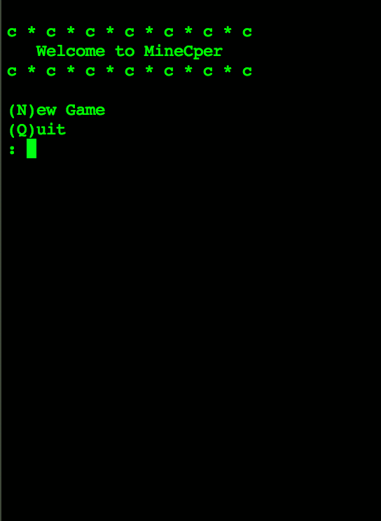

# MineCper

This is a command line Minesweeper clone written in the C language.

## Demo

## Description and Features

When the game launches, the player is welcomed to the MineCper app and prompted to choose either N for New Game or Q for Quit. The commands are not case sensitive.

Starting a new game generates a game board of size 8x8 and 10 randomly placed mines. Rows are marked with the letters A-H and columns with the numbers 1-8. The player can then choose which square to reveal by inputting the command. A1 or 1A will reveal the square in the top left corner. These commands are also not case sensitive.

When the player opens a square that is safe, a number representing the number of mines around that square is revealed. If the player opens a square with no mines around it, those squares are automatically revealed. The same thing happens to any automatically revealed mines that have no mines around them until the whole safe area has been revealed.

In order to mark an unopened square as a potential mine, the player can add an asterisk (\*) after the coordinates. A1* or 1A* would mark the square in the top left corner with a blue "c", which represents the mine flag. There is a mine counter at the bottom, which shows the number of mines left to discover.

The command Q can be used at any time to quit the current game and return to the main menu.

If the player hits a mine, the game ends. Undiscovered mines are shown as red asterisks, and incorrectly placed flags are turned into yellow crosses. The player is then prompted to press enter to return to the main menu where they can either quit or start a new game with a new randomly generated board.

To win the game, the player must open all the squares that have no mine in them. Upon opening the last square, any unmarked mines are automatically marked with flags, and the player is congratulated on their victory. They are then prompted to press enter to return to the main menu.

## Potential Future Developments

1. Cleaner feedback for invalid commands.
2. The ? marker.
3. Reveal around selected open square.
4. Custom board size and number of mines.
5. Timer.
6. Saving high scores.
